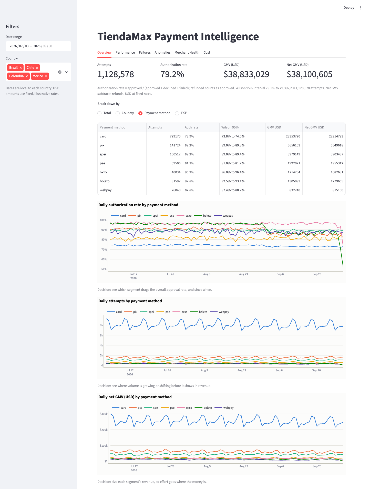
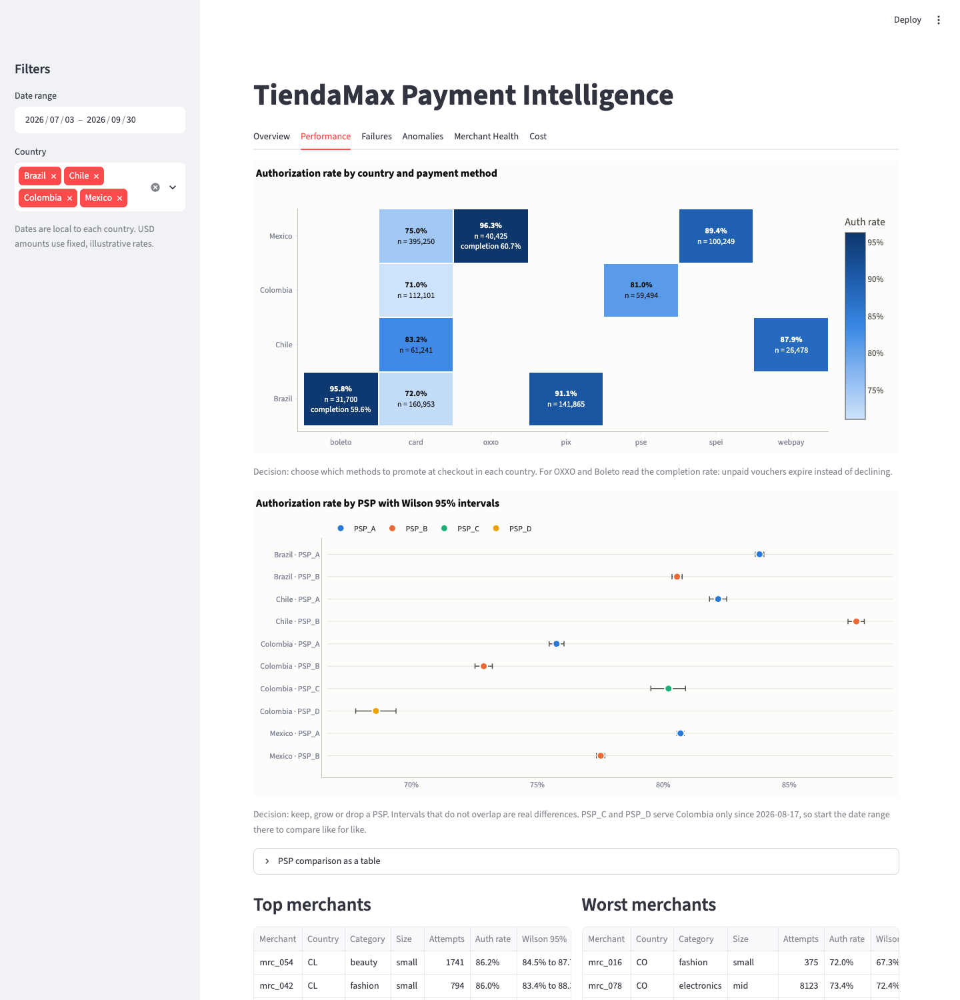
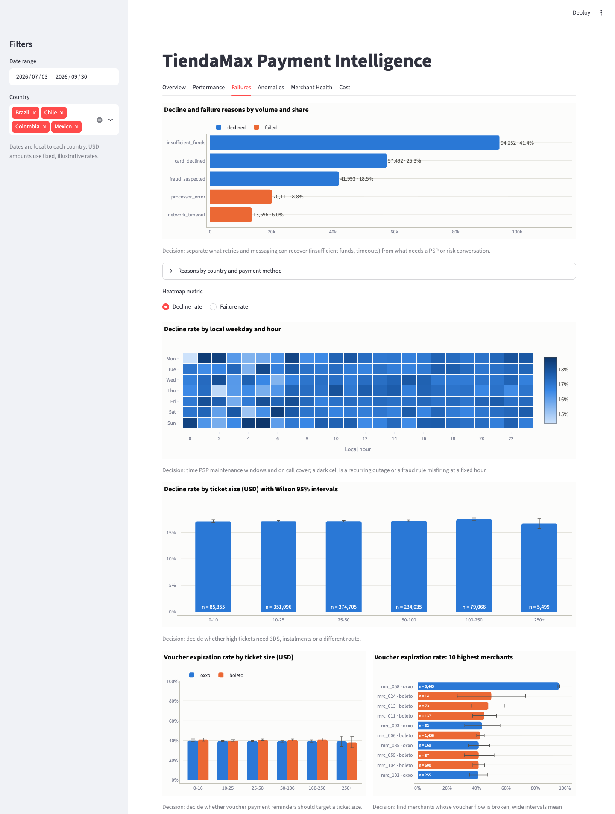
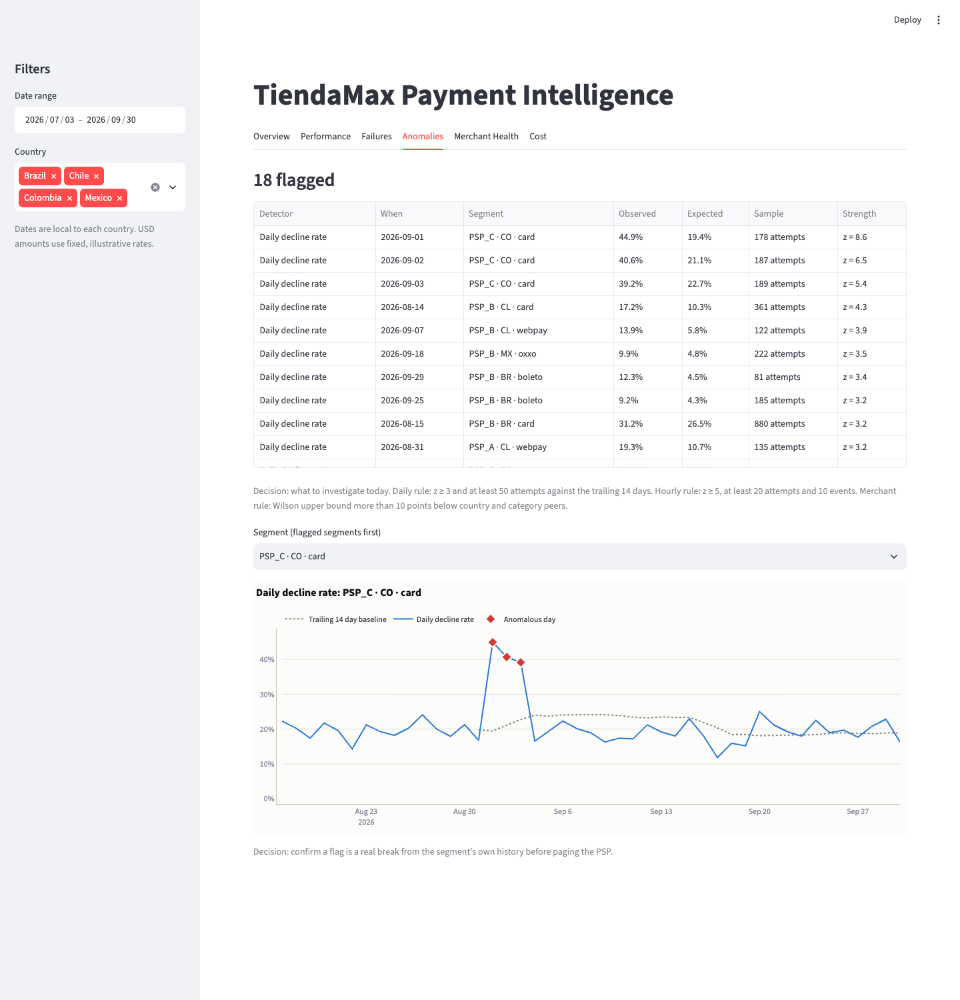
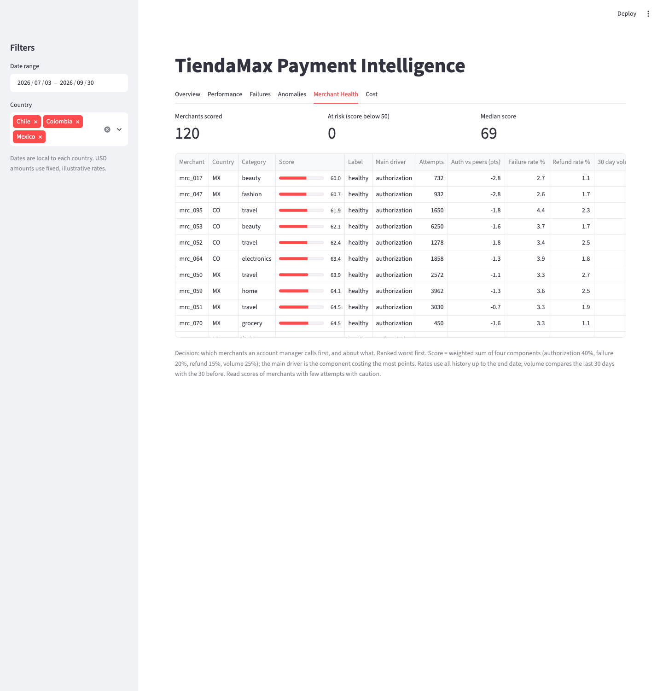
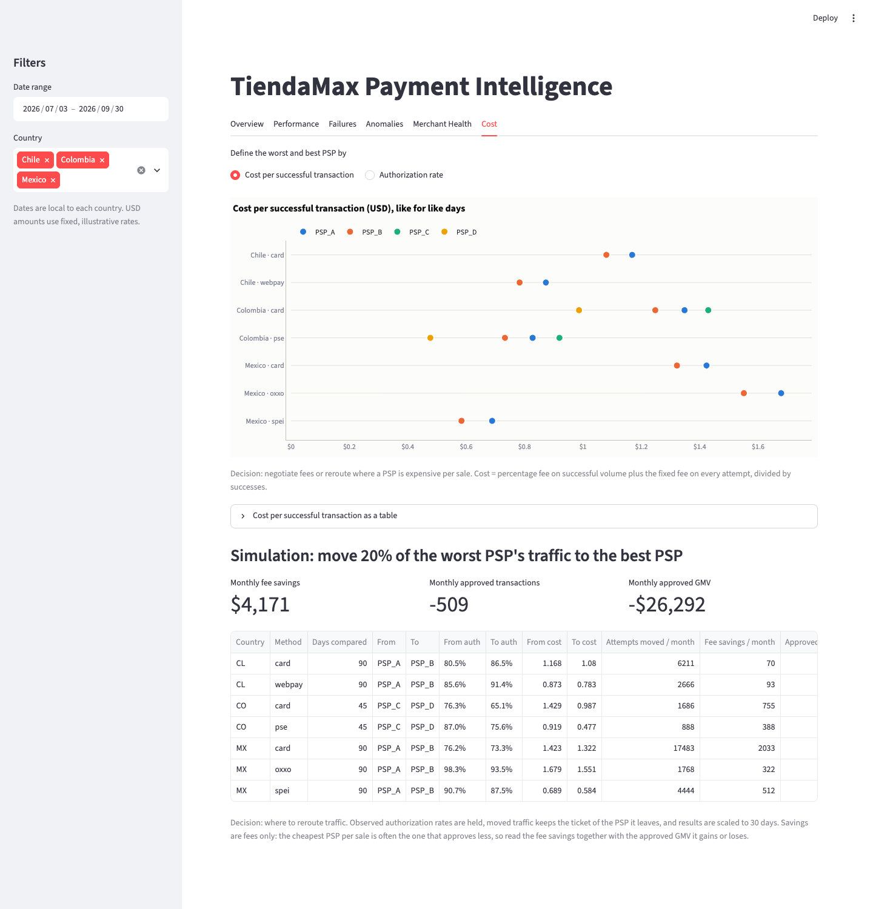

# TiendaMax Payment Intelligence

Analytics prototype for TiendaMax on raw Yuno transaction webhooks: a seeded synthetic dataset, a
Polars pipeline to Parquet, tested metric definitions with Wilson intervals, anomaly detection and
a Streamlit dashboard.

## Run it

```bash
docker compose up --build
```

Then open <http://localhost:8501>. The `pipeline` service generates the data, builds the marts and
exits; the `app` service starts once it has completed. Give Docker at least 4 GB of memory: the
default dataset is 1.2 million transactions and the pipeline peaks at about 2.4 GB.

## Develop locally

```bash
python3.11 -m venv .venv && source .venv/bin/activate
make install
make check
```

| Target | What it does |
| --- | --- |
| `make install` | Install runtime and development dependencies |
| `make data` | Generate the synthetic raw files |
| `make pipeline` | Generate if raw data is missing, ingest, build marts, log the headline findings |
| `make test` / `make lint` / `make typecheck` | pytest / ruff check / mypy strict |
| `make check` | Format check, lint, mypy and pytest, in that order |
| `make app` | Run the dashboard locally (needs `make pipeline` first) |
| `make up` / `make down` | Start or stop the Docker Compose stack |

## Layout

- `data_gen/`: synthetic webhook generator
- `pipeline/`: `ingest` (raw to staging), `transform` (staging to marts), `quality`, `run`
- `analytics/`: `metrics` (definitions), `anomalies`, `health` (merchant score), `cost` (PSP cost)
- `app/`: Streamlit dashboard
- `data/`: generated at run time, not versioned (`raw/`, `staging/`, `marts/`)

## Documentation

- [docs/ANALYSIS.md](docs/ANALYSIS.md): answers to the four business questions, with numbers
- [docs/DECISIONS.md](docs/DECISIONS.md): design decisions, metric definitions, trade offs
- [docs/WORKLOG.md](docs/WORKLOG.md): build steps, independent checks, validation, open items

## Status

Every module and all six dashboard tabs work. Known gaps are listed under "Open items" in the
worklog.

## Screenshots







